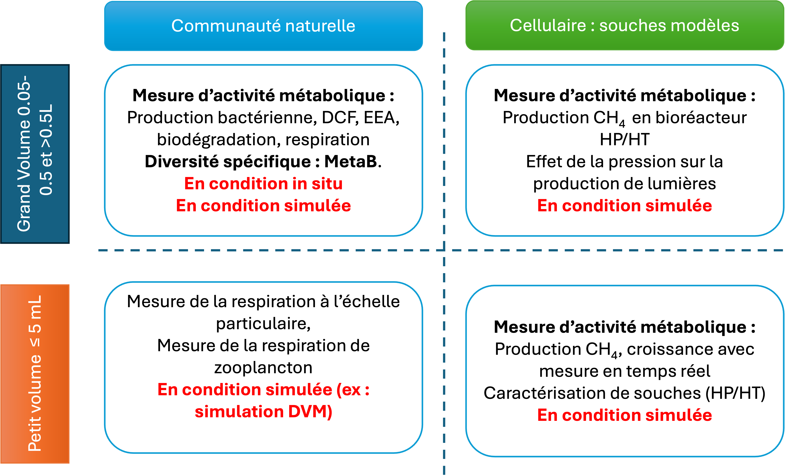

Ma recherche se concentrent sur l'interface entre la microbiologie marine et l'ingénierie environnementale. J'étudie comment les microorganismes s'adaptent aux environnements extrêmes (i.e pression hydrosstatique) à différentes écahelles.

{fig-alt="Illustration de la recherche" fig-align="center" width="80%"}

## Axes de Recherche

### 1. Adaptation aux Hautes Pressions (Piezophilie)

Étude des mécanismes d'adaptation des microorganismes aux environnements à haute pression, notamment dans les zones bathypélagiques.- **Outils** : culture en laboratoire à haute pression, bioréacteurs HP/HT, bioréacteurs en saphir, respiration microbienne.

### 2. Instrumentation Océanographique

Développement d'instruements pour la collecte et la mesure d'activités métabolique dans les conditions in situ de pression et température.

### 3. Diversité des microorganismes extrêmophile

Etude a de la diversité des microorganismes issus des zones méso- et bathypélagique. Par ailleurs, j'étudie la biodiversité des microorganismes thermophile provenant des sources hydrothermales.- **Outils** : métabarcoding (16S rRNA shortreads et longreads), culture en laboratoire, imagerie microscopique.

## Collaborations Financées

-   [**HOTDOG**](https://www.anr-hotdog.cnrs.fr/) (ANR, 2023-2027) ; [**APERO**](https://www.aperocruise.fr/)(ANR, 2022-2026) ; **BIOBLUE** (AMIDEX, 2025-2027)

-   [**OCEAN ICU**](https://ocean-icu.eu/)( European project, 2022-2027) : OceanICU is a Horizon Europe project aiming to produce new data, information and understanding on the role of the Ocean in the global carbon cycle.

-   **IIT** (CNRS, 2025-2026) PI : Développement instrumentales pour la collecte et la mesure d'activités métabolique dans les conditions in situ de pression et température. Ce projet est cofinancé par [ICMCB](https://www.icmcb-bordeaux.cnrs.fr/) et le défi [MIO](https://www.mio.osupytheas.fr/fr/).

-   [**ANF MetaBiodiv**](https://anfmetabiodiv.mio.osupytheas.fr/) (CNRS-INSU, 2022-2026) : Exploration de la Diversité Taxonomique des Ecosystèmes par Metabarcoding Caractériser la biodiversité environnementale afin d’étudier l’impact du changement global sur les milieux et de l’anthropisation de la planète. Ces enjeux nécessitent l’acquisition de connaissances sur la biodiversité pour répondre aux grands défis planétaires (e.g. modéliser, anticiper, prévenir les catastrophes écologiques), aux objectifs de développement durable, et contribuer aux grandes transitions de la société dans un contexte de changement climatique.

```         
```